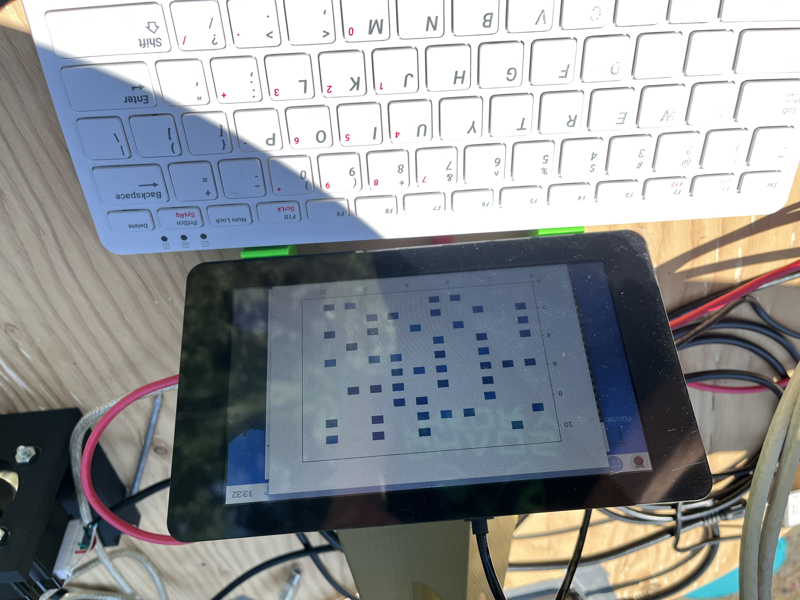

### Arecibito ("little Arecibo" - yet another tiny radio telescope)

This repo contains OpenSCAD designs, Arduino and Raspberry Pi code for my build of the "tiny radio telescope."

This project was loosely inspired by the versions built by [Gonçalo Nespral](https://hackaday.io/project/161556-tiny-radio-telescope/details) and [The Thought Emporium](http://www.youtube.com/watch?v=aeah3fFYlnA).

https://owen-mccormick.github.io/media/radiotelescope0.webm

